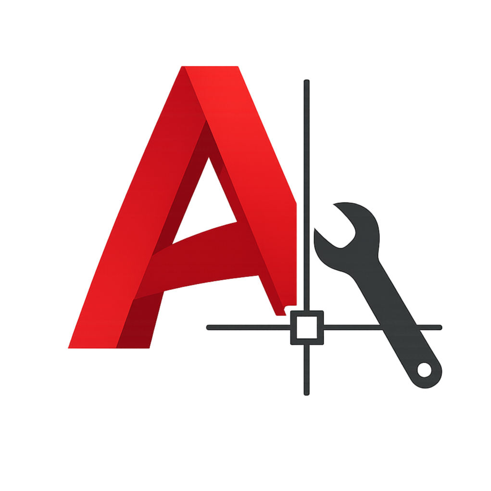

<p align="center">
  
</p>

<h1 align="center">AutoCAD Tools</h1>

Collection of AutoLISP and Visual LISP tools for architects and AutoCAD power users.

# AutoCAD Tools

A collection of AutoLISP tools, utilities, and workflow enhancements for architects, designers, and CAD professionals.

This repository contains a growing set of tools developed to automate repetitive tasks, improve drafting efficiency, and extend AutoCAD with practical features for architectural workflows.

---

## Features

* AutoLISP and Visual LISP tools
* DCL and modern UI experiments
* Architectural drafting utilities
* Annotation and documentation tools
* Layer management tools
* Workflow automation
* Package-based distribution through **nKit**

---

## nKit

nKit is the central package manager for this repository.

It provides a unified interface for:

* Installing tools
* Updating packages
* Loading and unloading commands
* Managing aliases
* Accessing documentation and tutorials

---

## Repository Structure

```text
autocad-tools/
│
├── nkit/          # Package manager
├── packages/      # Individual tools
├── metadata/      # Manifests and package data
├── docs/          # Documentation
└── examples/      # Sample files
```

---

## Philosophy

> Architects should not only use tools — they should be able to build them.

This project explores the intersection of architecture, automation, and software development by creating practical tools that improve everyday design workflows.

---

## Author

Masoud Nasiri

Architect building tools for architects.

---

## License

MIT License

---

<details>
<summary>Persian/Farsi</summary>

# ابزارهای اتوکد

مجموعه‌ای از ابزارها، اسکریپت‌ها و افزونه‌های AutoLISP برای معماران، طراحان و کاربران حرفه‌ای اتوکد.

هدف این پروژه توسعه ابزارهایی است که بتوانند فرایندهای تکراری را خودکار کرده، سرعت ترسیم را افزایش دهند و قابلیت‌های جدیدی را به محیط AutoCAD اضافه کنند.

---

## امکانات

* ابزارهای AutoLISP و Visual LISP
* رابط‌های کاربری مبتنی بر DCL و فناوری‌های جدید
* ابزارهای ترسیمی معماری
* ابزارهای اندازه‌گذاری و مستندسازی
* مدیریت لایه‌ها
* اتوماسیون فرایندهای کاری
* مدیریت و توزیع ابزارها از طریق **nKit**

---

## nKit

nKit هسته مدیریتی این مجموعه است.

این ابزار امکانات زیر را فراهم می‌کند:

* نصب ابزارها
* بروزرسانی بسته‌ها
* بارگذاری و غیرفعال‌سازی دستورات
* مدیریت نام‌های میانبر
* دسترسی به مستندات و آموزش‌ها

---

## ساختار مخزن

```text
autocad-tools/
│
├── nkit/
├── packages/
├── metadata/
├── docs/
└── examples/
```

---

## فلسفه پروژه

> معماران نباید صرفاً مصرف‌کننده ابزارها باشند؛ آن‌ها باید بتوانند ابزارهای خود را نیز بسازند.

این پروژه تلاشی برای پیوند میان معماری، اتوماسیون و توسعه نرم‌افزار است تا ابزارهایی متناسب با نیازهای واقعی فرایند طراحی ایجاد شود.

---

## توسعه‌دهنده

مسعود نصیری

معماری که برای معماران ابزار می‌سازد.

---

## مجوز

MIT License

</details>
